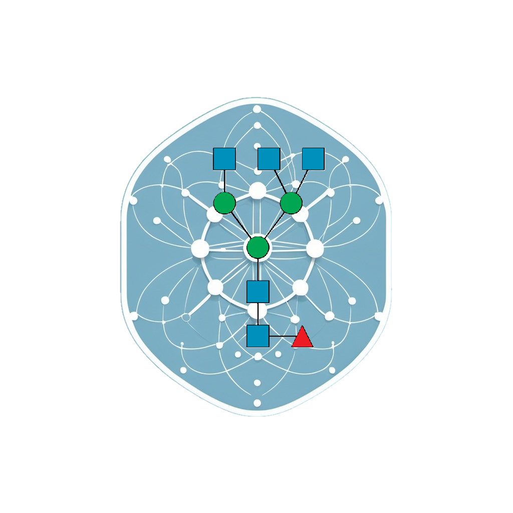

# iGFA

iGFA is a Python package that estimates Glycosylation Flux Profiles and enzymatic and residence time contributions utilizing experimentally measured antibody product quality attributes. 

Visit https://cabsel.github.io/iGFA/ for package documentation.

Now available on Pypi: 

This is part of the manuscript: 
